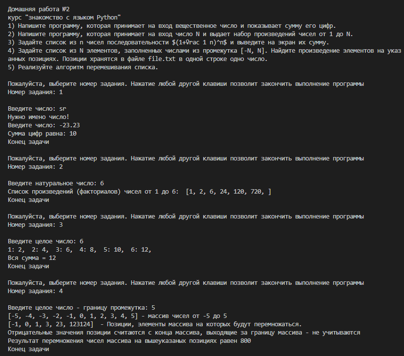
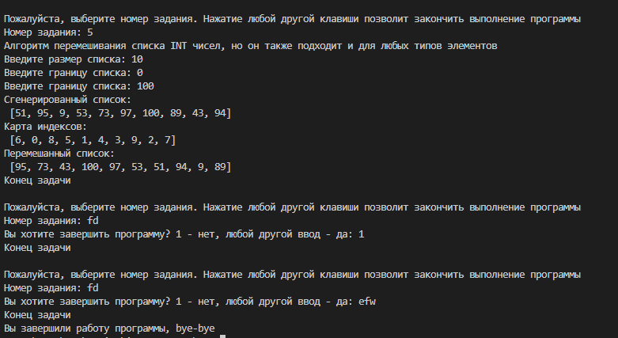

# Урок 2. Циклы (for, while)
## домашнее задание   

1) Напишите программу, которая принимает на вход вещественное число и показывает сумму его цифр.  
Пример:  
6782 -> 23  
0,56 -> 11   
  
Ключевой код:
```
def convert_fract_to_whole(frac_num):
    if frac_num < 0 : frac_num = -frac_num # убираем возможный минус
    remnant = frac_num%1
    while remnant%1 > 0: # убираем дробную часть
        frac_num *= 10 
        remnant = frac_num%1
    return frac_num
        
def num_length(n): 
    len = 0
    while n > 0:
        n //= 10
        len += 1
    return len

def sum_of_nums(len):
    sum = 0
    n=len
    while len > 0:
        a = n%(10**(len))// (10**(len-1))
        len -= 1
        sum = sum + a
    return sum

def start():
    print()
    n = convert_fract_to_whole(num_input("Введите число: "))
    print (f"Сумма цифр равна: {sum_of_nums(n)}")
```
2) Напишите программу, которая принимает на вход число N и выдает набор произведений чисел от 1 до N.  
Пример:  
пусть N = 4, тогда [ 1, 2, 6, 24 ] (1, 1*2, 1*2*3, 1*2*3*4)  

Ключевой код (решение без использования списков):
```
def factorial_no_list(n):
    fact = 1
    print('[', end='')
    for i in range(1, n + 1):
        fact *= i
        print(fact, end=', ')
    print(']')

def start():
    print()
    n = input_int_number(invite_msg, exeption_msg)
    if n<0: n=-n # Убираем возможный минус
    print(f'Список произведений (факториалов) чисел от 1 до {n}: ', end=' ')
    # print(factorial_list(n))
    factorial_no_list(n)

invite_msg = 'Введите натуральное число: '
exeption_msg = 'Только натуральные числа!'
```
решение со списком:
```
def factorial_list(n):
    fact_list = []
    fact = 1
    for i in range(1, n + 1):
        fact *= i
        fact_list.append(fact)
    return fact_list
```
решение через рекурсию:
```
def fact(n):
    if n == 1:
        return 1
    else:
        return n * fact(n - 1)
```
3) Задайте список из n чисел последовательности ```$(1+\frac 1 n)^n$``` и выведите на экран их сумму. Пример: - Для n = 6: ```{1: 4, 2: 7, 3: 10, 4: 13, 5: 16, 6: 19}```  
В этом задании возникли вопросы к формулировке задачи - необходимо вывести сумму (то есть одно число), а в качестве примера выводится последовательность чисел. Вероятнее всего нужно получить последовательность сумм, да ещё и округлённых до ближайшего целого. Именно реализация такого решения представлена ниже, однако полного соответствия добиться не удалось. Возможно, округление в примере происходит на после вычисления каждого члена последовательности. Учитывая, что последовательность стремиться к числу "e", округление происходит до числа три. Кроме того стартует, приведённая последовательность, вероятно, со второго члена.Не стал уж совсем подгонять результат. Результатом выполнения кода получается следущая последовательность ```{1: 2,  2: 4,  3: 6,  4: 8,  5: 10,  6: 12}```

Ключевой код:
```
from functions import input_int_number

def formula(n):
    sum = 0
    for i in range(1,n+1):        
        sum += int((1+1/i)**i)
        print(f'{i}: {sum}', end=',  ')
    print(f'\nВся сумма = {sum}')

def start():
    print()
    formula(input_int_number(invite_msg, exeption_msg))   

invite_msg = 'Введите целое число: '
exeption_msg = 'Только целые числа!'

```
4) Задайте список из N элементов, заполненных числами из промежутка [-N, N]. Найдите произведение элементов на указанных позициях. Позиции хранятся в файле file.txt в одной строке одно число.  

Ключевой код:
```
def start():

    print()
    n = input_int_number(invite_msg, exeption_msg)
    array = [i for i in range(-n,n+1)]

    print(f'{array} - массив чисел от {-n} до {n}')

    pos_from_file = set()
    positions = set() 
    
    with open(os.path.join(sys.path[0],'file.txt'), 'r') as data: 
        for line in data: pos_from_file.add(line.strip())

    mult = 1
    for i in pos_from_file:
        try: 
            num = int(i)
            positions.add(num)
            mult*=array[num]
        except Exception as error: pass # print(error) отладка
    a=list(positions)
    a.sort()
    print(a, ' - Позиции, элементы массива на которых будут перемножаться.\nОтрицательные значения позиции считаются с конца массива, выходящие за границу массива - не учитываются')
    print(f'Результат перемножения чисел массива на вышеуказаных позициях равен {mult}')

invite_msg = 'Введите целое число - границу промежутка: '
exeption_msg = 'Только целые числа!'

```
5) Реализуйте алгоритм перемешивания списка.  

Ключевой код:
```
def generate_random_map(array):  
    map = list()
    while len(map)< len(array):
        item = random.randrange(len(array)) 
        if item not in map:
            map.append(item)
    return map

def rearrange_list(array, map):
    rearranged_list = list(range(len(array)))
    j=0
    for i in map:
        rearranged_list[i] = array[j]
        j+=1
    return(rearranged_list)


def start():  
    print(f'Алгоритм перемешивания списка INT чисел, но он также подходит и для любых типов элементов')
    array = generate_random_int_list(input_int_number(msg_total),input_int_number(msg_bound),input_int_number(msg_bound))
    print('Сгенерированный список:\n', array)
    print('Карта индексов:\n', map:=generate_random_map(array))
    print('Перемешанный список:\n', rearrange_list(array, map))

msg_total = 'Введите размер списка: '
msg_bound = 'Введите границу списка: '
msg_exep = 'Только целые числа!'

```

### Результат выполнения программы:  


