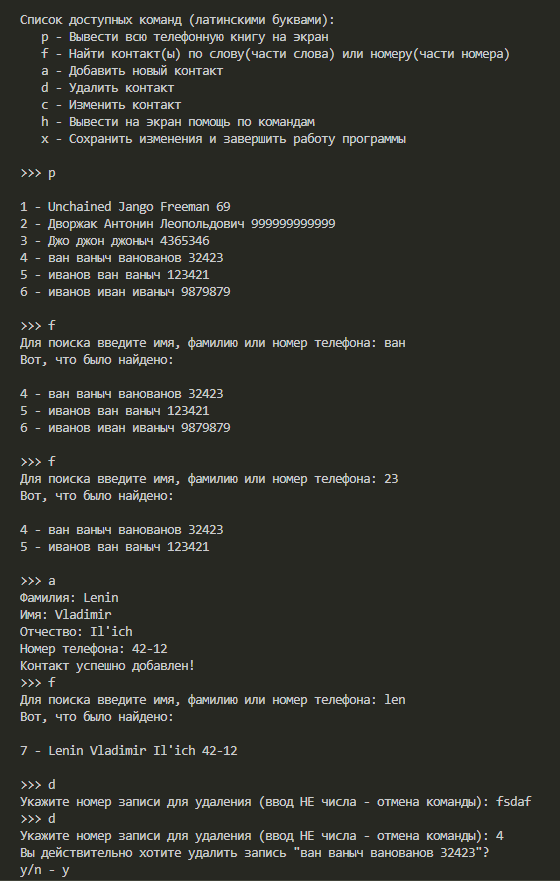
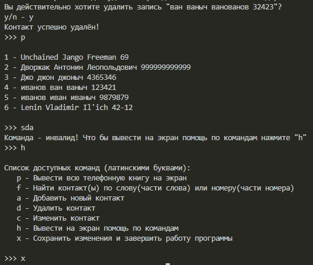

# Знакомство с языком Python (семинары)
## Урок 8. Работа с файлами
#

**Задача.** *Создать телефонный справочник с возможностью импорта и экспорта данных в формате .txt. Фамилия, имя, отчество, номер телефона - данные, которые должны находиться в файле.  
Программа должна выводить данные.  
Программа должна сохранять данные в текстовом файле.  
Пользователь может ввести одну из характеристик для поиска определенной записи(Например имя или фамилию человека).  
Использование функций. Ваша программа не должна быть линейной.  
Дополнить телефонный справочник возможностью изменения и удаления данных.  
Пользователь также может ввести имя или фамилию, и Вы должны реализовать функционал для изменения и удаления данных.*

Справочник запускается функцией ```main()``` из модуля ```main.py```.   
В ```user_interface.py``` находятся команды помощи и функция для запуска нового цикла ввода команды.  
В ```controller.py``` - инструменты взаимодействия с пользователем.  
В ```operations.py``` - все операции, которые выполняются в программе, по команде или без поступающей из controller.py.  

Пример вывод программы:  





# 
Не сделано, но хотелось бы:
1. Добавить проверок на корректность ввода имени и телефона
2. Добавить logger.py (эт для себя, что бы опробовать) где сохраняются таймштампы со всеми действиями, добавил , удалил. Открыл, закрыл и т.д
3. Импорт в excel. ну и экспорт уж
4. Разобраться, можно ли менять файл на ходу. Не перезаписывать же каждый раз...
